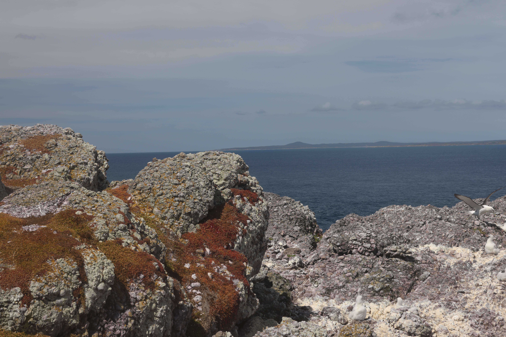
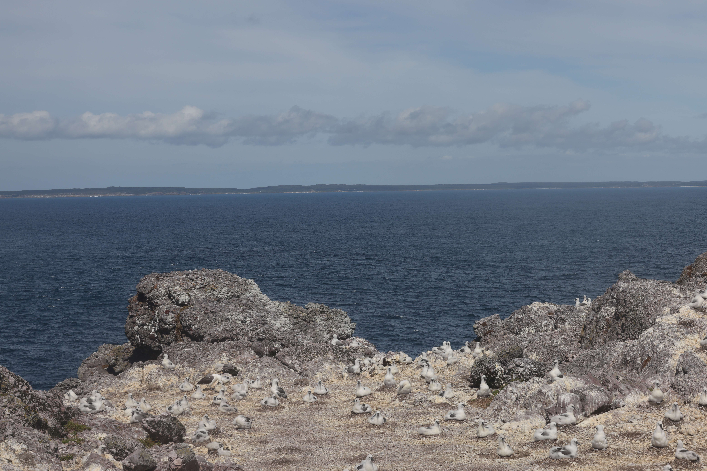
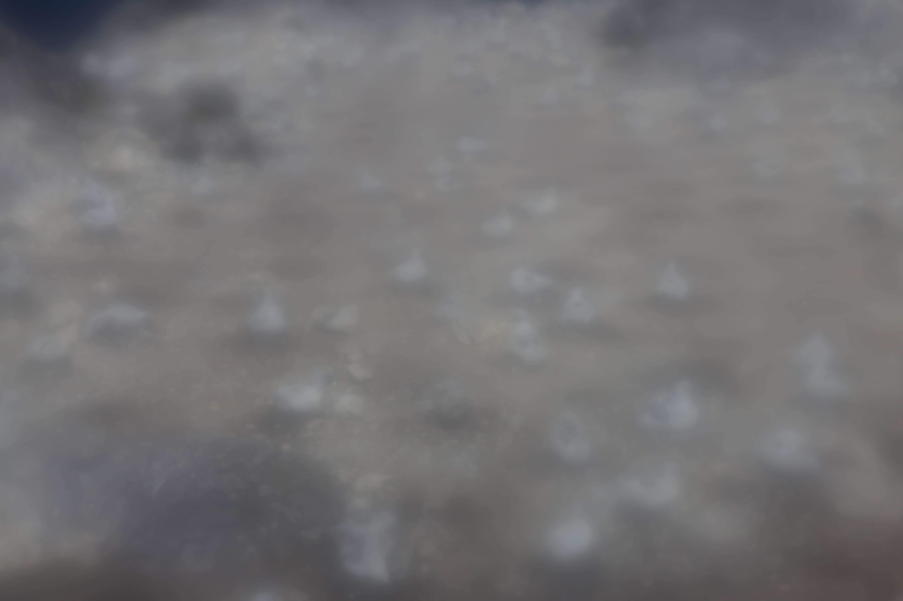
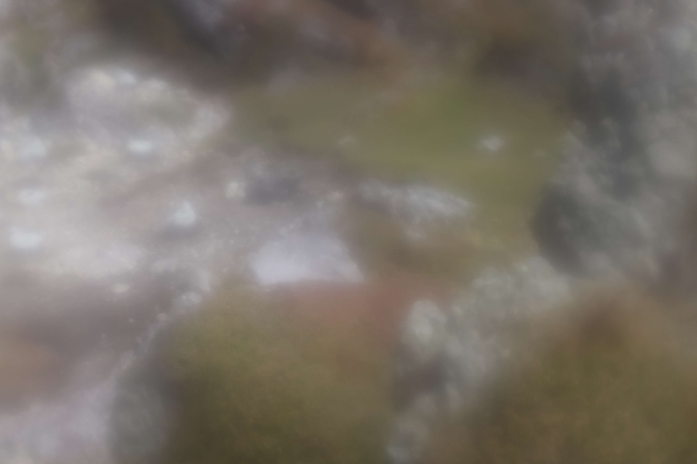
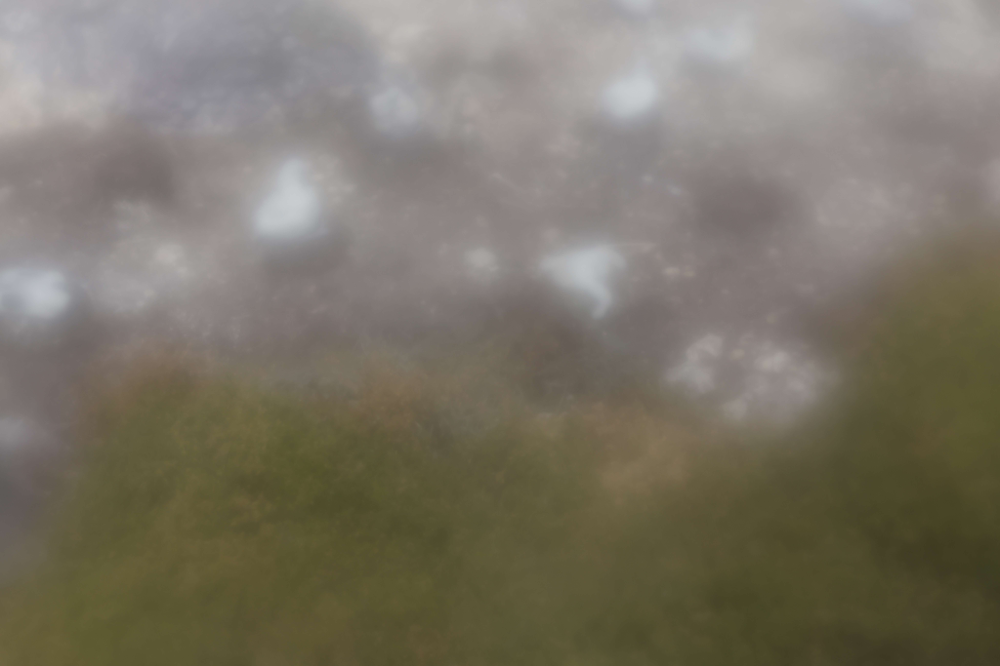

# Albatross Island Monitoring

Remote monitoring of the Albatross Island shy albatross colony is possible with the CRAGS (CSIRO Ruggedised Autonomous Gixapixel System - CSIRO) camera system. 
The system captures and transmits high-resolution images daily, providing a continuous visual record of colony health and activity. 
Several indices are derived from these images, and provided in near-real time to allow early warning of unusual changes in abundance of nesting and attending adults and chicks.

---

## Daily Images

<table width = "1000">

  <tr>
    <td width = "500"> </td>
    <td width = "100"></td>
    <td width = "500"> </td>
    <td width = "100"></td>
    <td width = "500"></td>
  </tr>
<tr>
    <td> </td>
    <td></td>
    <td> </td>
    <td></td>
    <td> </td>
  </tr> 
<tr>
    <td> </td>
    <td></td>
    <td> </td>
    <td></td>
    <td> </td>
  </tr> 
  
</table>

--- 

## Contact

For information about this work, please contact:
- **Alistair Hobday**  
  *Chief Research Scientist, CSIRO*  
  Email: [alistair.hobday@csiro.au](mailto:alistair.hobday@csiro.au)

- **Carlie Devine**  
  *Senior Research Technician, CSIRO*  
  Email: [carlie.devine@csiro.au](mailto:carlie.devine@csiro.au)
---

## Acknowledgments

--- 

<a href = "https://www.csiro.au/en/about/Policies/Legal/Copyright">Copyright</a> | <a href = "https://www.csiro.au/en/about/Policies/Legal/Legal-notice">Legal notice and disclaimer</a>
